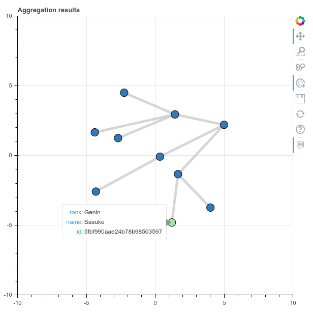

# mongraph
A tool for visualizing mongodb records as a network of nodes. Useful when working with hierarchies or references with the CLI gets tough.

## Usage
### Install mongraph
```
$ pip install git+https://github.com/ramitmittal/mongraph
```

### Prepare a pipeline
Write a JSON file containing an aggregation pipeline. Ensure that you `project` the following fields:  
* `id` - any hashable type
* `connectsTo` - an array of ids (connect nodes using the id field)
* `attributes` - an object with all the other properties of the record you want to see on the graph (nested objects don't work)

### Run mongraph
```
$ mongraph --uri mongodb://localhost:27017 --db test --collection user --pipeline pipeline.json
```

## Examples
A sample [dataset](samples/ninja/data.json)
```
{"_id":{"$oid":"5fbf98f0ae24b78b98503594"},"name":"Kakashi","rank":"Jonin","reportsTo":{"$oid":"5fbf997eae24b78b9850359d"}}
{"_id":{"$oid":"5fbf98f7ae24b78b98503595"},"name":"Asuma","rank":"Jonin","reportsTo":{"$oid":"5fbf997eae24b78b9850359d"}}
{"_id":{"$oid":"5fbf9904ae24b78b98503596"},"name":"Naruto","rank":"Genin","reportsTo":{"$oid":"5fbf98f0ae24b78b98503594"}}
{"_id":{"$oid":"5fbf990aae24b78b98503597"},"name":"Sasuke","rank":"Genin","reportsTo":{"$oid":"5fbf98f0ae24b78b98503594"}}
{"_id":{"$oid":"5fbf9917ae24b78b98503598"},"name":"Ino","rank":"Genin","reportsTo":{"$oid":"5fbf98f7ae24b78b98503595"}}
{"_id":{"$oid":"5fbf991eae24b78b98503599"},"name":"Shikamaru","rank":"Genin","reportsTo":{"$oid":"5fbf98f7ae24b78b98503595"}}
{"_id":{"$oid":"5fbf9927ae24b78b9850359a"},"name":"Choji","rank":"Genin","reportsTo":{"$oid":"5fbf98f7ae24b78b98503595"}}
{"_id":{"$oid":"5fbf9935ae24b78b9850359b"},"name":"Kurenai","reportsTo":{"$oid":"5fbf997eae24b78b9850359d"}}
{"_id":{"$oid":"5fbf9947ae24b78b9850359c"},"name":"Hinata","reportsTo":{"$oid":"5fbf9935ae24b78b9850359b"}}
{"_id":{"$oid":"5fbf997eae24b78b9850359d"},"name":"Hiruzen","rank":"Kage"}
```
A sample [aggregation pipeline](samples/ninja/pipeline.json)
```
[
  {
    "$project": {
      "_id": 0,
      "id": { "$toString": "$_id" },
      "connectsTo": [{"$toString": "$reportsTo" }],
      "attributes": {
        "id": { "$toString": "$_id" },
        "rank": "$rank",
        "name": "$name"
      }
    }
  }
]
```

This dataset and aggregation pipeline are provided in the `samples` directory. Just copy the `samples/` dir to your local machine and run:
```
$ cd samples/ninja

$ mongoimport --uri mongodb://localhost:27017/test --collection ninjas data.json

$ mongraph --uri mongodb://localhost:27017 --db test --collection ninjas --pipeline pipeline.json
```

## Sample Output
