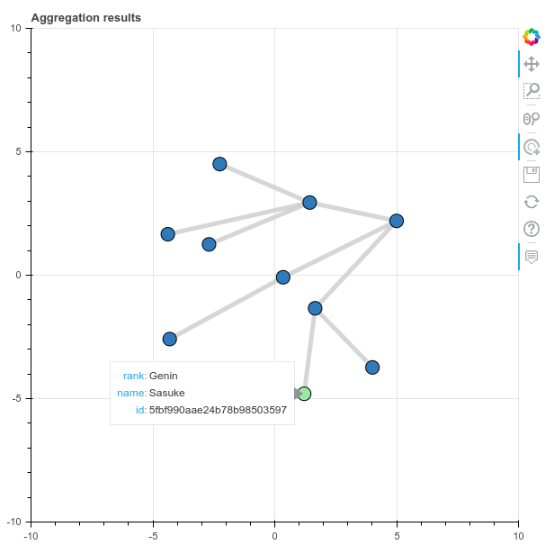

# mongraph
A tool for visualizing mongodb records as a network of nodes. Useful when working with hierarchies or references with the CLI gets tough.

## Usage
### Install mongraph
```
$ pip install git+https://github.com/ramitmittal/mongraph
```

### Prepare a pipeline
Write a JSON file containing an aggregation pipeline. Ensure that you `project` the following fields:  
* `id` - any hashable type
* `connectsTo` - an array of a hashable type
* `attributes` - an object with all the other properties of the record you want to see on the graph

### Run mongraph
```
$ mongraph --uri mongodb://localhost:27017 --db test --collection user --pipeline pipeline.json
```

## Examples
A dataset and aggregation pipeline are provided in the `samples` directory. Just copy the `samples/` dir to your local machine and run:
```
$ cd samples/

$ mongoimport --uri mongodb://localhost:27017 --db test --collection ninjas ninja_data.json

$ mongraph --uri mongodb://localhost:27017 --db test --collection ninjas pipeline.json
```

## Sample Output
